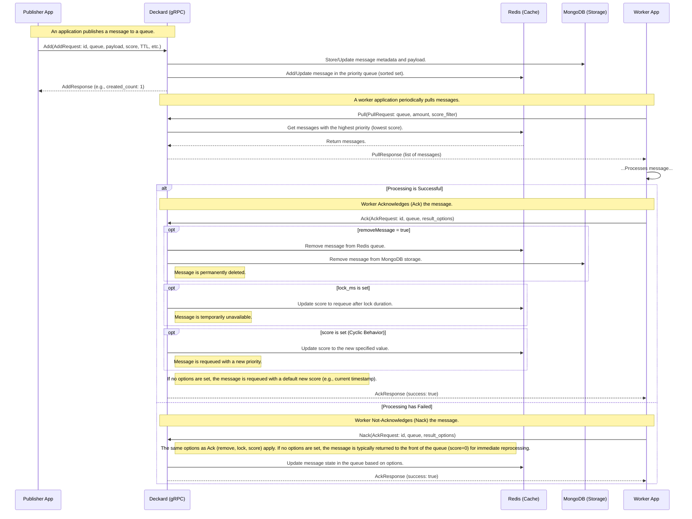

# Deckard Components

## Storage

The storage is responsible for persisting the messages and queue configurations.

Deckard currently supports the following Storage engines:
- Memory (default)
- MongoDB
  - Supported versions: `5.0.18` to `6.0.6` (we always run our integration tests against the `5.0.18` and the latest version)

The memory implementation is mainly used in tests and local development and is not recommended for production use.

## Cache

The cache is currently the main component of Deckard. It is used to manage messages priorities and the queues themselves.

Deckard currently supports the following Cache engines:
- Memory (default)
- Redis
  - Supported versions: `5.0.14` to `7.0.11` (we always run our integration tests against the `5.0.14` and the latest version)

The memory implementation is mainly used in tests and local development and is not recommended for production use.

## Message Flow

The following diagram illustrates the complete lifecycle of a message within the Deckard system. It shows the interaction between a Publisher Application that creates messages, the Deckard service itself (backed by a cache and a storage), and a Worker Application that consumes and processes these messages.

The flow demonstrates the three main stages:

- Add: A publisher sends a message with its configuration (like priority score and TTL) to Deckard.
- Pull: A worker requests a batch of the highest-priority messages available in a queue.
- Ack/Nack: After processing, the worker notifies Deckard of the outcome. This final step is crucial as it controls whether a message is removed permanently or requeued, potentially with a new priority score or a temporary lock. This requeueing mechanism is what enables Deckard's signature cyclic behavior.

## Housekeeper

The housekeeper is responsible for several background tasks that are necessary for the correct functioning of the service.

The following tasks are currently being performed by the housekeeper:
- Handles deadline timeout of messages that haven't received an acknoledgement for a specific period;
- Unlock messages that have been locked by the application;
- Remove expired messages from the queue;
- Compute metrics from the system and queues;
- Remove elements from queues that are limited by size;

If you run Deckard with memory storage or cache engines, the housekeeper must also run in the same service instance since everything is stored locally, but running with any other engines we suggest running the housekeeper in a separate instance to avoid any performance issues, since it would be competing resource usage against the gRPC service.

## Audit

Deckard provides an audit system that can be used to log all requests and responses to the service.

The audit system is currently implemented with the [ElasticSearch](https://www.elastic.co/pt/elasticsearch/) and a dashboard for [Kibana](https://www.elastic.co/pt/kibana/) is also provided.

The kibana dashboard template is in the [kibana.ndjson](dashboards/kibana.ndjson) file.

Few images of the Audit dashboard:

## Trace and Metrics

Deckard provides instrumentation for trace and metrics that can be used in any observability system. Both systems are implemented with [OpenTelemetry](https://opentelemetry.io/).

Metrics will be exposed in the `/metrics` endpoint and traces must be exported to a OpenTelemetry Collector using the OTLP exporter, configured with their [environment variables](https://opentelemetry.io/docs/specs/otel/protocol/exporter/). Deckard currently only exports traces using the gRPC exporter.

A Grafana dashboard template is also provided in the [grafana.json](dashboards/grafana.json) file.

Deckard currently exports the following metrics:

| Name | Type | Description | Labels |
| ---- | ---- | ----------- | ---- |
| deckard_exceeding_messages_removed | Counter | Number of messages removed from storage for exceeding maximum queue size | `queue` |
| deckard_exceeding_messages_cache_removed | Counter | Number of messages removed from cache for exceeding maximum queue size | `queue` |
| deckard_housekeeper_task_latency | Histogram | Time in milliseconds to complete a housekeeper task. | `task`` |
| deckard_oldest_message | Gauge | Time the oldest queue message was used. This is the time the message was last acknoledged with success or added to the queue. | `queue` |
| deckard_total_messages | Gauge | Number of messages a queue has. | `queue` |
| deckard_ttl_messages_removed | Counter | Number of messages removed from storage for ttl | `queue` |
| deckard_ttl_messages_cache_removed | Counter | Number of messages removed from cache for ttl | `queue` |
| deckard_message_unlock | Counter | Number of unlocked messages. | `queue`, `lock_type` |
| deckard_message_timeout | Counter | Number of message timeouts | `queue` |
| deckard_ack | Counter | Number of acks received | `queue`, `reason` |
| deckard_nack | Counter | Number of nacks received | `queue`, `reason` |
| deckard_messages_empty_queue | Counter | Number of times a pull is made against an empty queue. | `queue` |
| deckard_storage_latency | Histogram | Storage access latency | `op`, `retry` |
| deckard_cache_latency | Histogram | Cache access latency | `op` |
| deckard_auditor_store_add_latency | Histogram | Latency to add an entry to be saved by storer sender | |
| deckard_auditor_store_latency | Histogram | Latency sending elements to the audit database | |

Deckard has other metrics used for diagnostic purposes. All metrics are defined in the `createMetrics` function of the [metrics.go](../internal/metrics/metrics.go) file.

> Histogram metrics are exported with millisecond precision.
>
> Default buckets are: `[0, 1, 2, 5, 10, 15, 20, 30, 35, 50, 100, 200, 400, 600, 800, 1000, 1500, 2000, 5000, 10000]`
>
> To change buckets you must set the `DECKARD_METRICS_HISTOGRAM_BUCKETS` environment variable with a comma separated list of values.

Grafana dashboard images:

## Logging

We use the [zap](https://github.com/uber-go/zap) project for Logging.

By default the application will log in JSON format. To change this behavior you must set the `DECKARD_LOG_TYPE` environment variable to `text` which will make the application to log in a more human readable format.
