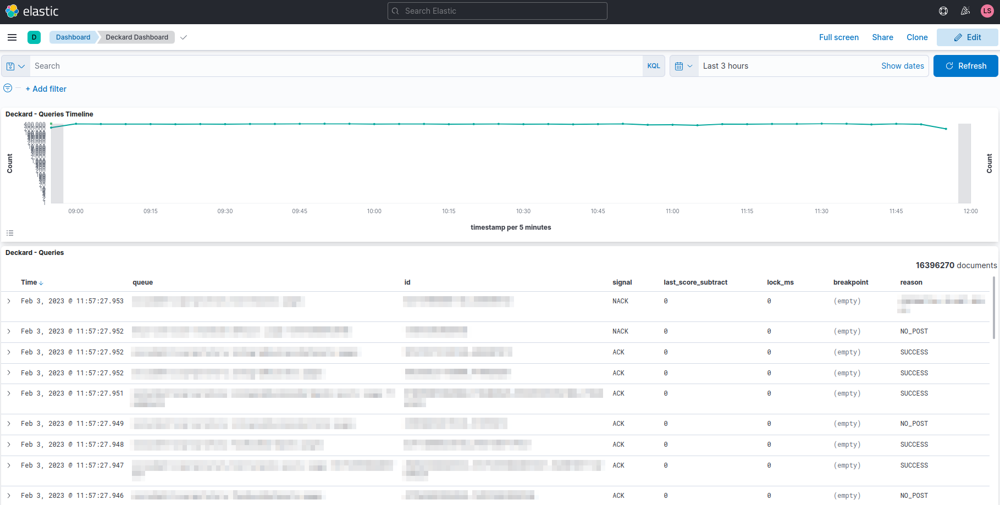
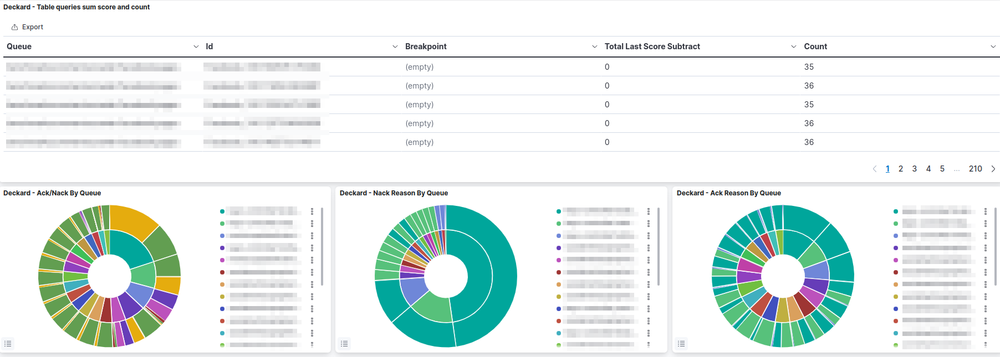
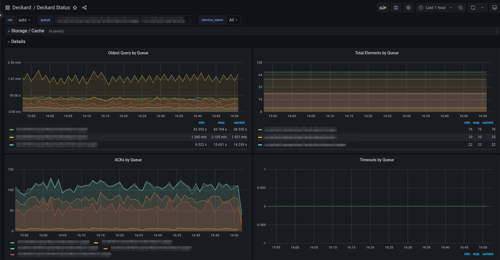
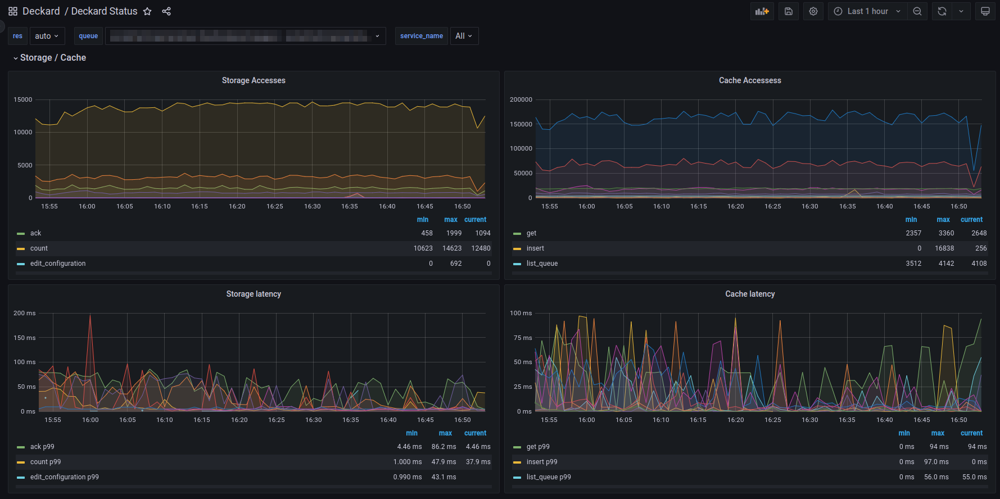
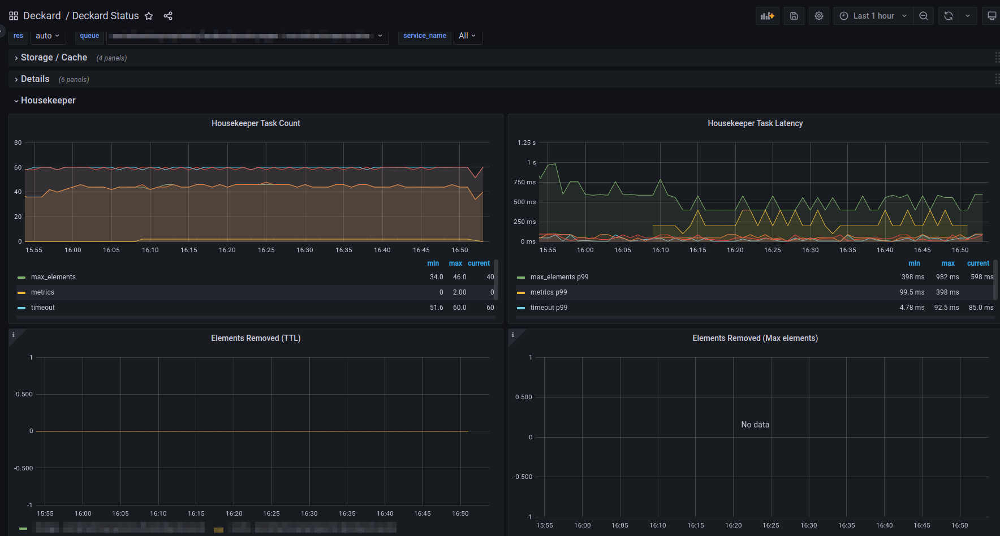

# Deckard Components

## Storage

The storage is responsible for persisting the messages and queue configurations.

Deckard currently supports the following Storage engines:
- Memory (default)
- MongoDB

The memory implementation is mainly used in tests and local development and is not recommended for production use.

## Cache

The cache is currently the main component of Deckard. It is used to manage messages priorities and the queues themselves.

Deckard currently supports the following Cache engines:
- Memory (default)
- Redis

The memory implementation is mainly used in tests and local development and is not recommended for production use.

## Housekeeper

The housekeeper is responsible for several background tasks that are necessary for the correct functioning of the service.

The following tasks are currently being performed by the housekeeper:
- Handles deadline timeout of messages that haven't received an acknoledgement for a specific period;
- Unlock messages that have been locked by the application;
- Remove expired messages from the queue;
- Compute metrics from the system and queues;
- Remove elements from queues that are limited by size;

If you run Deckard with memory storage or cache engines, the housekeeper must also run in the same service instance since everything is stored locally, but running with any other engines we suggest running the housekeeper in a separate instance to avoid any performance issues, since it would be competing resource usage against the gRPC service.

## Audit

Deckard provides an audit system that can be used to log all requests and responses to the service.

The audit system is currently implemented with the [ElasticSearch](https://www.elastic.co/pt/elasticsearch/) and a dashboard for [Kibana](https://www.elastic.co/pt/kibana/) is also provided.

The kibana dashboard template is in the [kibana.ndjson](dashboards/kibana.ndjson) file.

Few images of the Audit dashboard:

## Trace and Metrics

Deckard provides instrumentation for trace and metrics that can be used in any observability system. Both systems are implemented with [OpenTelemetry](https://opentelemetry.io/).

Metrics will be exposed in the `/metrics` endpoint and traces must be exported to a OpenTelemetry Collector using the OTLP exporter, configured with their [environment variables](https://opentelemetry.io/docs/specs/otel/protocol/exporter/). Deckard currently only exports traces using the gRPC exporter.

A Grafana dashboard template is also provided in the [grafana.json](dashboards/grafana.json) file.

Grafana dashboard images:

## Logging

We use the [zap](https://github.com/uber-go/zap) project for Logging.

By default the application will log in JSON format. To change this behavior you must set the `DECKARD_LOG_TYPE` environment variable to `text` which will make the application to log in a more human readable format.